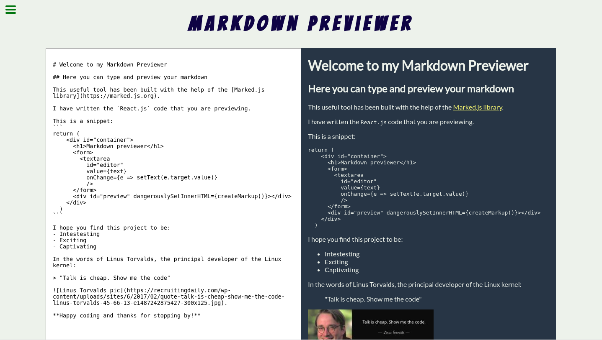

# [Markdown Previewer](https://andy-mc-donald.github.io/markdown-previewer/)

[FreeCodeCamp Front End Libraries Project #2](https://www.freecodecamp.org/learn/front-end-libraries/front-end-libraries-projects/build-a-markdown-previewer), built using:

* React
* [Marked.js](https://www.npmjs.com/package/marked)
* JavaScript
* CSS 
* HTML

The Markdown Previewer fulfills the following user stories: 

1. I can see a textarea element with a corresponding id="editor".

2. I can see an element with a corresponding id="preview".

3. When I enter text into the #editor element, the #preview element is updated as I type to display the content of the textarea.

4. When I enter GitHub flavored markdown into the #editor element, the text is rendered as HTML in the #preview element as I type (HINT: You don't need to parse Markdown yourself - you can import the Marked library for this: https://cdnjs.com/libraries/marked).

5. When my markdown previewer first loads, the default text in the #editor field should contain valid markdown that represents at least one of each of the following elements: a header (H1 size), a sub header (H2 size), a link, inline code, a code block, a list item, a blockquote, an image, and bolded text.

6. When my markdown previewer first loads, the default markdown in the #editor field should be rendered as HTML in the #preview element.

*This project was bootstrapped with [Create React App](https://github.com/facebook/create-react-app).*
